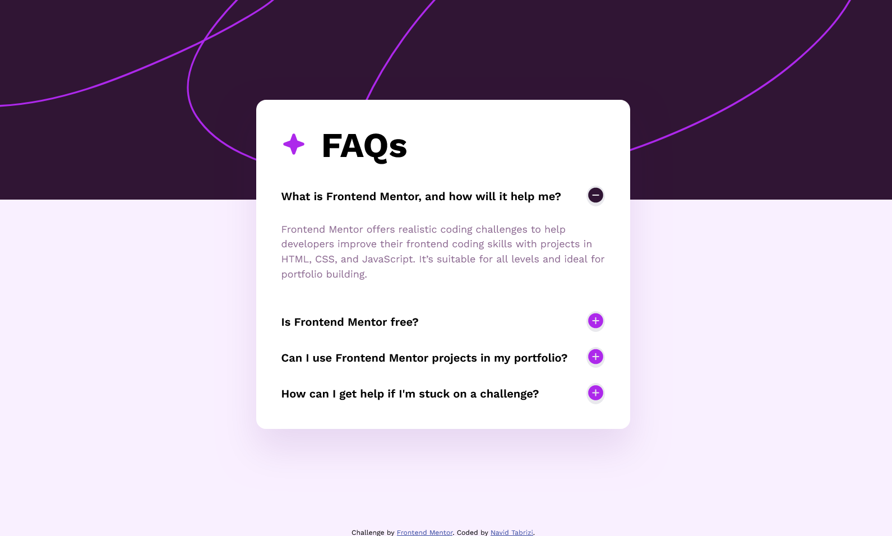
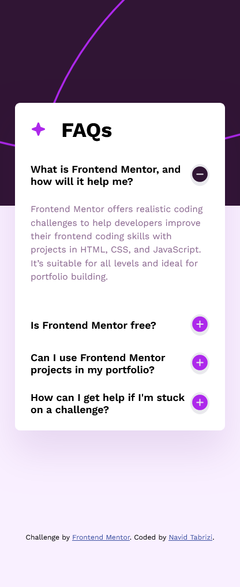

# Frontend Mentor - FAQ Accordion Challenge

This project is my solution to the FAQ Accordion challenge on Frontend Mentor. Frontend Mentor is a platform that provides real-world projects to help improve your coding skills. The challenge involves creating a responsive FAQ accordion using HTML, CSS, and JavaScript.

## Table of Contents

-   [Introduction](#introduction)
-   [Screenshot](#screenshot)
-   [Installation](#installation)
-   [Usage](#usage)
-   [Contributing](#contributing)
-   [Acknowledgements](#acknowledgements)

## Introduction

The challenge was to build a FAQ accordion that allows users to toggle between questions and answers. The project utilizes HTML for structure, CSS for styling, and JavaScript for interactivity.

### Screenshot




## Installation 

1. Clone the repository:

    ```bash
    git clone https://github.com/navidTabrizi90/faq-accordion.git

    ```

2. Open the project directory:
    ```bash
     cd faq-accordion
    ```
3. Open the HTML file (index.html) in your preferred web browser.

## Usage

Simply open the `index.html` file to view the FAQ accordion. The accordion is styled using CSS, and JavaScript is used to handle toggling between questions and answers.

## Contributing

If you'd like to contribute to this project, follow these steps:

1. Fork the project.
2. Create your feature branch (`git checkout -b feature/YourFeature`).
3. Commit your changes (`git commit -m 'Add some feature'`).
4. Push to the branch (`git push origin feature/YourFeature`).
5. Open a pull request.

## Acknowledgements

-   Challenge by [Frontend Mentor](https://www.frontendmentor.io?ref=challenge)
-   Coded by [Navid Tabrizi] ([navidTabrizi90](https://github.com/navidTabrizi90))
